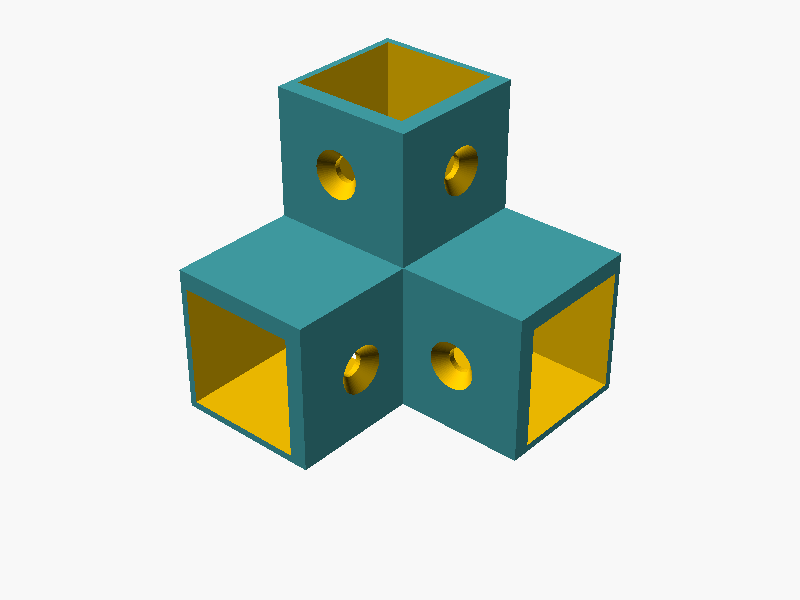
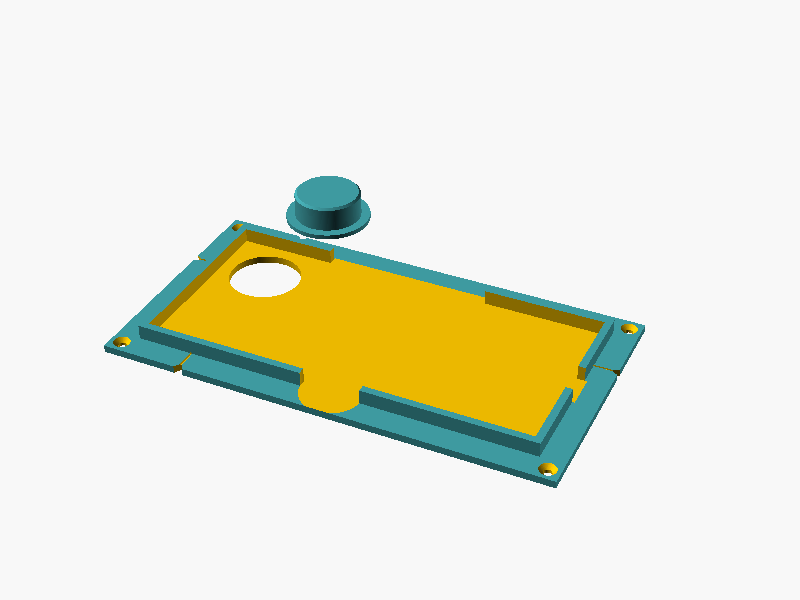
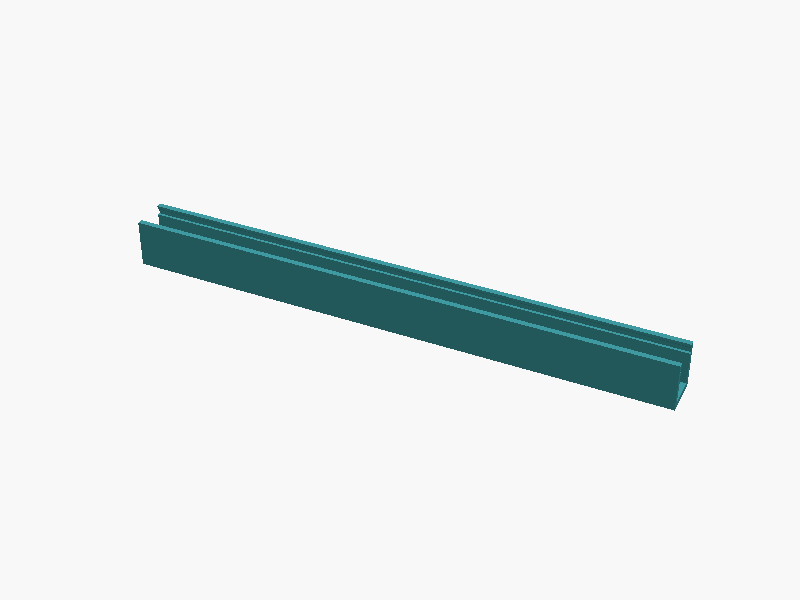
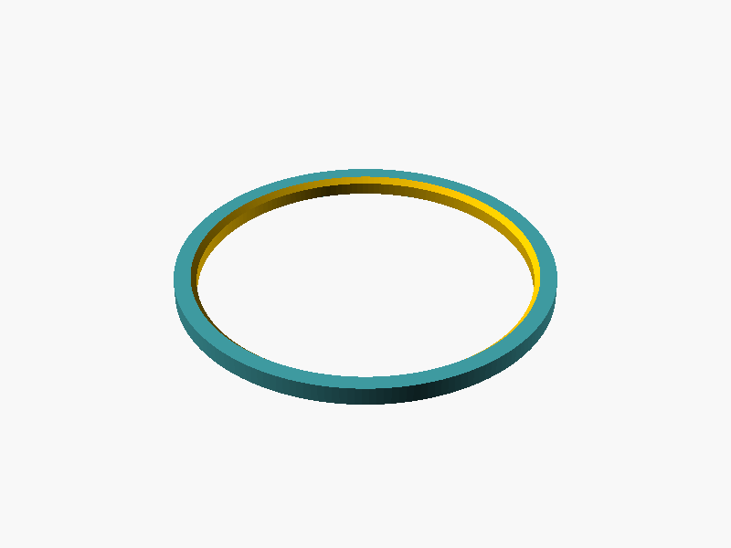
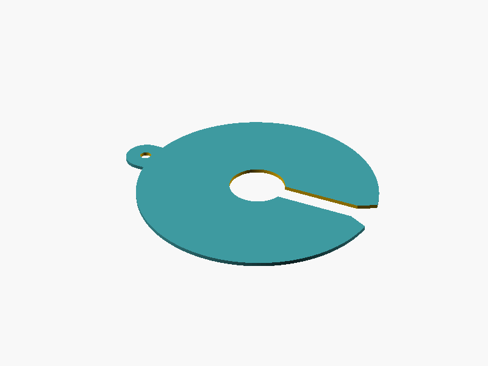
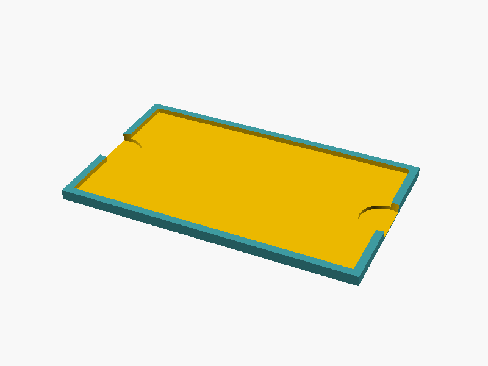
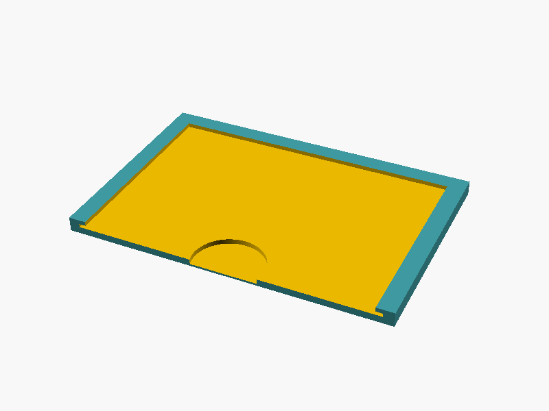
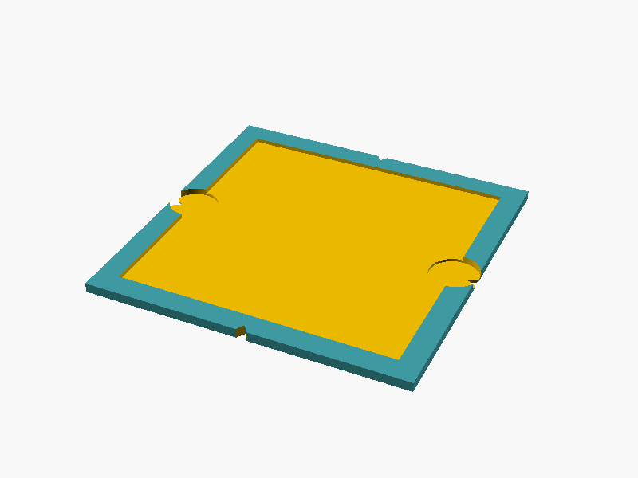

# Druckteile für die Fotobox

Hier liegen alle 3D-Druckteile für die Fotobox aus Kapitel 4 des Leitfadens.
(Im Leitfaden heißt der Ordner noch `fotobox/` – gemeint ist dieser Ordner.)

| Datei / Ordner | Was ist das? |
|---|---|
| `fotobox_teile.scad` | **Die eine Zeichnungsdatei** mit allen 8 Teilen. Wird mit OpenSCAD geöffnet. Alle Maße stehen oben als Zahlen und lassen sich im „Customizer“ ändern. |
| `stl/` | Fertige Druckdateien (STL) mit den **Standardwerten**. Die Datei gibst du deinem Slicer (z. B. PrusaSlicer, Cura, Bambu Studio). |
| `vorschau/` | Bilder der Teile, so wie sie auf dem Druckbett liegen. |

> **Wichtig:** Einige Standardwerte sind nur **Platzhalter** (z. B. Handy-Maße und
> Topf-Maße). Diese Teile erst drucken, wenn du deine eigenen Maße eingetragen hast –
> siehe „Was du messen musst“ und die Platzhalter-Liste am Ende.
>
> Sofort druckbar (wenn deine Teile den Standardmaßen entsprechen): Eckverbinder
> (Leiste genau 20 mm), LED-Leiste (Streifen 10 mm breit), Etikettenhalter
> (Karte 85 × 55 mm), Maßstab-Halter (Karte 100 × 100 mm).
> Erst nach dem Messen: Handyhalter, Zentrierring, Abdeckscheibe, Farbkarten-Halter
> (Dicke der Karte nachmessen).

---

## Die Teile im Überblick

| | Teil (`teil = …`) | Wozu? | Stück | Material |
|---|---|---|---|---|
|  | **Eckverbinder** (`eckverbinder`) | Verbinden die Leisten zum Rahmen. Jede Ecke hat drei Hülsen: eine senkrechte, zwei waagerechte. Alle 8 Ecken sind gleich; oben wird der Verbinder einfach umgedreht. | **8** | PETG oder PLA, matt schwarz (die 4 unteren sind im Foto) |
|  | **Handyhalter** (`handyhalter`) | Liegt auf dem Deckel und hält das Handy flach (Display oben, quer). Die Hauptkamera liegt genau über dem Loch. Mit Aussparungen für Ladekabel und Tasten, Griffmulde, Kerben zum Ausrichten und einem kleinen **Zentrierdorn** (das runde Teil daneben). | **1** (+ 1 Dorn) | PETG oder PLA |
|  | **LED-Leiste** (`led_leiste`) | Kanal für den LED-Streifen. Vorne hält eine Nut den Diffusor (Milchglasfolie oder Opal-Platte), damit die LEDs nicht direkt auf die Pflanze leuchten. 200 mm lang, 2 Stück je Boxseite. | **8** | PETG (LEDs werden warm) |
|  | **Zentrierring** (`zentrierring`) | Flacher Ring auf dem Boden. Der Topf wird hineingestellt und steht so immer an derselben Stelle. | **1 je Topfgröße** | PLA matt schwarz |
|  | **Abdeckscheibe** (`abdeckscheibe`) | Dünne Scheibe mit Schlitz und Mittelloch. Deckt Erde und Topfrand ab, damit sie im Foto nicht als „braun“ zählen. Griffnase mit Loch zum Aufhängen. | **2–3 je Topfgröße** | PLA matt schwarz |
|  | **Farbkarten-Halter** (`farbkarten_halter`) | Flache Mulde für die Farbkarte (Calibrite ColorChecker Classic Mini). Der Rand ist schmal und liegt **neben** der Karte – er verdeckt keine Farbfelder. | **1** | PLA matt schwarz |
|  | **Etikettenhalter** (`etikettenhalter`) | Flache Tasche für die Topf-Karte (85 × 55 mm). Schmale Lippen an drei Seiten halten das Papier flach, die vierte Seite ist offen zum Einschieben (zur Klappe hin). | **1** | PLA matt schwarz |
|  | **Maßstab-Halter** (`massstab_halter`) | Flache Platte mit Mulde für die Maßstab-Karte 10 × 10 cm. Wird auf Bücher oder eine Kiste in typischer Blatthöhe gelegt und einmal fotografiert. Kerben zeigen die Mitte jeder Seite. | **1** | PLA matt schwarz |

**Alles, was im Foto zu sehen ist, druckst du in mattem Schwarz** (kein glänzendes
„Silk“-Filament): Das Programm sortiert sehr dunkle Bildpunkte aus, und matte Flächen
spiegeln nicht. Eine Rolle Filament reicht für alle Teile.

---

## Druckeinstellungen (Richtwerte)

Allgemein: Düse 0,4 mm, **Schichthöhe 0,2 mm**, **keine Stützen** (alle Teile liegen
in der Datei schon richtig herum: flache Seite unten), 4 Schichten oben und unten.
Die Seite, die später die Kamera sieht, liegt beim Druck oben – auf glatten
Druckplatten wird die Unterseite oft glänzend.

| Teil | Wände (Perimeter) | Füllung (Infill) | Hinweise |
|---|---|---|---|
| Eckverbinder | 4 | 30–40 % | Über den waagerechten Hülsen druckt der Drucker eine Brücke von ca. 21 mm – das geht ohne Stützen. Hängt sie durch: Lüfter auf 100 %, langsamer drucken. **Erst einen Verbinder als Passprobe drucken** und eine Leiste einstecken. |
| Handyhalter | 3 | 20 % | Zuerst prüfen, ob das Handy hineinpasst und die Linse mittig über dem Loch liegt. |
| LED-Leiste | 3 | 20 % | PETG. Bei Verzug Rand (Brim) einschalten. |
| Zentrierring | 3 | 20 % | – |
| Abdeckscheibe | 3 | 100 % | Dünnes Teil, langsam drucken (erste Schicht sauber). |
| Farbkarten-Halter, Etikettenhalter, Maßstab-Halter | 3 | 15–20 % | Mit hohem Sockel (`sockel_hoehe`) reichen 10–15 % Füllung. |

Bei PLA ca. 200–215 °C Düse und 60 °C Bett, bei PETG ca. 230–245 °C und 70–80 °C
(Herstellerangaben auf der Rolle haben Vorrang).

---

## So trägst du deine Maße ein (OpenSCAD)

1. **OpenSCAD installieren:** kostenlos von [openscad.org](https://openscad.org/)
   (Windows, macOS, Linux).
2. **Datei öffnen:** „File“ → „Open“ → `fotobox_teile.scad`.
3. **Customizer einblenden:** Rechts erscheint die Leiste „Customizer“. Falls nicht:
   Menü „Window“ (deutsch „Fenster“) → Haken bei „Hide Customizer“ entfernen.
4. **Teil wählen:** Ganz oben bei `teil` das gewünschte Teil aus der Liste wählen.
5. **Maße eintragen:** Die Gruppen (z. B. „Handyhalter“) aufklappen und die Zahlen
   ändern. Alle Maße in **Millimetern**, Kommazahlen mit **Punkt** schreiben
   (`63.5`, nicht `63,5`). Ein Haken bedeutet „ja“, kein Haken „nein“.
6. **Vorschau:** F5 (schnell). **Rendern:** F6 – dauert Sekunden bis zu einer Minute,
   erst danach lässt sich exportieren.
7. **Exportieren:** F7 bzw. „File“ → „Export“ → „Export as STL…“, Dateiname z. B.
   `handyhalter.stl`. Für jedes Teil wiederholen: Teil wählen, F6, F7.
8. **Meldungen lesen:** Unten im Fenster „Console“ (sonst „Window“ → „Console“)
   stehen Zeilen mit `ECHO`:
   - `OK: …` – das Teil passt aufs Druckbett.
   - `WARNUNG: …` – etwas passt nicht (z. B. zu groß fürs Druckbett). Erst beheben.
   - `HINWEIS: …` – nützliche Werte, z. B. Breite des Diffusorstreifens.
   - `ZUSCHNITT: …` – beim Eckverbinder: die Längen der Leisten für deine Maße.
9. **Werte sichern:** Damit deine Maße nicht verloren gehen, oben im Customizer mit
   dem „+“-Knopf einen Parametersatz anlegen (z. B. „Meine Box“) und speichern.
   OpenSCAD legt dann neben der `.scad`-Datei die Datei `fotobox_teile.json` an.
   Alternativ die Zahlen direkt links im Text ändern und mit Strg+S speichern.

**Passungs-Spiel:** Klemmt die Leiste im Eckverbinder, `spiel` um 0.1 erhöhen; wackelt
sie, um 0.1 verringern. Für Handy und Karten gibt es eigene Werte (`handy_spiel`,
`karten_spiel`).

---

## Was du messen musst

Messen mit dem Messschieber, in Millimetern. Bei den Töpfen jeweils 3 Töpfe messen
und den **größten** Wert nehmen. Hast du mehrere Topfgrößen, druckst du für jede
Größe einen eigenen Zentrierring und eigene Abdeckscheiben.

### Topf und Pflanze (Maße A–G aus Tabelle 3.2 des Leitfadens)

| Maß | Bedeutung | Einstellung in der Datei | Für welches Teil |
|---|---|---|---|
| **A** | Topf oben, Außenkante Rand | `topf_oben_A` | Abdeckscheibe (Durchmesser = A + 10 mm) |
| **B** | Topf unten (Boden außen) | `topf_unten_B` | Zentrierring (innen = B + 1 mm) |
| **G** | Stängel-Büschel über der Erde | `stiel_loch_G` | Mittelloch der Abdeckscheibe (ca. 30 mm) |
| C, D, E, F | Topfhöhe, Pflanzenbreite und -höhe | – (nur für die Box-Höhe) | Ergibt im Karton-Test die Innenhöhe → `box_hoehe` |

### Handy (immer **ohne Hülle** messen – es liegt immer ohne Hülle im Halter)

| Was | Einstellung |
|---|---|
| Länge (lange Seite), Breite (kurze Seite), Dicke | `handy_laenge`, `handy_breite`, `handy_dicke` |
| Mitte der **Hauptkamera-Linse**: Handy hochkant **von hinten** ansehen (Kamera oben). Abstand der Linsenmitte zur **oberen** Kante und zur **linken** Kante. | `linse_von_oben`, `linse_von_links` |
| Kamera-Insel (Buckel), falls sie vorsteht und größer als das 30-mm-Loch ist: von hinten gesehen Abstand ihrer oberen linken Ecke zur oberen und linken Kante, dazu Breite und Höhe. Sonst alles auf 0 lassen. | `insel_von_oben`, `insel_von_links`, `insel_breite`, `insel_hoehe` |
| Seitentasten: Handy **von vorne** (Display) hochkant ansehen – sind die Tasten rechts oder links? Von wo bis wo (Abstand ab der oberen Kante)? | `tasten_seite`, `tasten_von`, `tasten_bis` |
| Ladebuchse: meist unten in der Mitte (dann 0). | `kabel_versatz` |

```
  1) Messen: Handy von HINTEN,        2) Im Halter, von oben gesehen (Display oben),
     hochkant, Kamera oben               Einstellung handy_oben = "links":

      obere Kante                                    hinten
     ┌───────────┐                       ┌──────────────────────────────┐
     │   ◉       │ ◉ = Hauptkamera  obere│ ◉                            │untere Kante
     │           │                  Kante│                              │mit Ladebuchse
     │           │                       └──────────────────────────────┘
     │           │                                vorne (Griffmulde)
     │           │
     └───────────┘                    Die lange Handyseite liegt links–rechts (Querformat).

  linse_von_oben  = Abstand von ◉ (Mitte) bis zur oberen Kante
  linse_von_links = Abstand von ◉ (Mitte) bis zur linken Kante (von hinten gesehen!)
```

**Welche Linse ist die Hauptkamera?** Kamera-App auf „1ד stellen und nacheinander
jede Linse mit dem Finger abdecken. Wird das Vorschaubild dunkel, ist es die
Hauptkamera.

`handy_oben` legt fest, ob die Oberkante des Handys im Halter links oder rechts liegt
(von oben aufs Display gesehen). Beides geht; wähle die Seite, bei der die Tasten gut
erreichbar sind (mit der Lautstärketaste wird ausgelöst). Im Querformat zeigt die
lange Handyseite immer nach links und rechts.

### Rahmen, Platten und Zubehör

| Was | Einstellung |
|---|---|
| Holzleiste nachmessen (oft nicht genau 20 mm!) – oder Alu-Profil 2020 = 20 | `leiste` |
| Dicke der Wand- und Deckelplatten | `platten_dicke` |
| Durchmesser des Lochs im Deckel (Lochsäge) | `deckel_loch_d` |
| Breite des LED-Streifens | `led_breite` |
| Dicke der Diffusorfolie bzw. Opal-Platte | `diffusor_dicke` |
| Farbkarte außen (Breite × Länge) und Dicke | `farbkarte_breite`, `farbkarte_laenge`, `farbkarte_dicke` |
| Topf-Karte (Vorschlag 85 × 55 mm) und Dicke | `etikett_laenge`, `etikett_breite`, `etikett_dicke` |
| Maßstab-Karte (100 × 100 mm, Papier auf Karton) und Dicke | `massstab_karte`, `massstab_dicke` |
| Größe deines Druckbetts | `druckbett_x`, `druckbett_y`, `druckbett_z` |
| Innenhöhe laut Karton-Test (Standard 700 mm) | `box_hoehe` |

---

## Zuschnittliste (Innenmaß 500 × 500 mm, Höhe 700 mm)

So ist der Rahmen gebaut: Die **senkrechten Leisten** stecken ganz durch die
Eckverbinder und stehen unten auf der Bodenplatte bzw. reichen oben bis an den Deckel.
Die **waagerechten Leisten** stecken in den seitlichen Hülsen und stoßen innen an die
senkrechte Leiste. Über die Eckverbinder gemessen ist der Rahmen dann
500 × 500 × 700 mm; die Platten kommen außen darauf.

### Leisten (Holz 20 × 20 mm oder Alu-Profil 2020)

| Leiste | Stück | Länge |
|---|---|---|
| senkrecht (Ecken) | 4 | **700 mm** (= Innenhöhe `box_hoehe`) |
| waagerecht (4 unten, 4 oben) | 8 | **457 mm** (lieber 0,5 mm kürzer als länger) |

Rechenweg: waagerecht = Innenmaß − 2 × (Außenwand + Spiel + Leistenmaß)
= 500 − 2 × (1,2 + 0,3 + 20) = **457 mm**.
Änderst du `leiste`, `eck_wand_aussen`, `spiel`, `box_innen` oder `box_hoehe`, zeigt
OpenSCAD die neuen Längen beim Eckverbinder in der Zeile `ZUSCHNITT` an.
Gleich lange Diagonalen je Seite = Rahmen ist rechtwinklig.

### Platten

| Platte | Stück | Maß | Material | Hinweis |
|---|---|---|---|---|
| Rückwand, 2 Seitenwände | 3 | 500 × 700 mm | Forex 3–5 mm matt weiß oder Kapa 5 mm | matte Seite nach innen |
| Vorderwand = Klappe | 1 | 500 × 700 mm | wie oben | 2 Scharniere + 2 Magnete (oder nur Magnete) |
| Boden | 1 | 500 × 500 mm | Forex, Sperrholz o. ä. | Oberseite matt schwarz oder dunkelgrau, z. B. mit schwarzem Moosgummi bekleben; der Rahmen steht darauf |
| Deckel | 1 | 500 × 500 mm | Forex matt weiß | **Loch Ø 30 mm genau in der Mitte** (Schnittpunkt der Diagonalen) |

**Lichtdicht machen:** Die Eckverbinder sind außen 1,2 mm dick. Darum liegen die Platten
an den Ecken auf den Verbindern und haben zu den Leisten ca. 1,5 mm Abstand. Am
einfachsten klebst du die Platten mit **Montageband (doppelseitiges Schaumklebeband,
ca. 1,5 mm dick)** auf die Leisten – dann liegen sie überall plan. Um die Öffnung der
Klappe ein schwarzes Schaumstoff-Dichtband (2–3 mm) kleben, damit sie ohne Lichtspalt
schließt.

### Schrauben (optional)

| Wofür | Was | Stück |
|---|---|---|
| Eckverbinder – Holzleisten | Senkkopf-Holzschrauben 3,5 × 16 mm | bis 32 (4 je Verbinder) |
| Eckverbinder – Alu-Profil 2020 | M5 × 10 mm Linsenkopf + Hammermutter Nut 6; dazu `eck_schraube_d = 5.5` und `eck_senkung` aus | bis 32 |
| LED-Leisten | Senkkopf-Holzschrauben 3 × 12 mm (oder Montageband) | 16 |
| Handyhalter auf dem Deckel | M3 × 12 mm Senkkopf + Mutter (oder Montageband) | 4 |
| Farbkarten- und Etikettenhalter | Standard: kleben. Schrauben nur bei dickem Boden (`befestigung = "schrauben"`) | 2 je Halter |

---

## Wo kommt welches Teil hin? (Ergänzung zu Abschnitt 4.6 im Leitfaden)

1. **Rahmen:** 4 Eckverbinder unten (senkrechte Hülse zeigt nach oben), 4 oben
   (umgedreht). Die Schraublöcher zeigen immer nach innen in die Box.
2. **LED-Leisten:** je Seite 2 Stück innen an die obere waagerechte Leiste, zwischen die
   Eckverbinder (je Seite sind ca. 406 mm Platz). Der LED-Streifen klebt im Kanal und
   läuft an den Ecken einfach um die Kurve weiter. Den Diffusorstreifen
   (**12,2 mm breit** zuschneiden) von der Stirnseite in die Nuten schieben.
3. **Handyhalter:** Deckel festschrauben. Halter auflegen, den **Zentrierdorn** (Kragen
   oben) durch das Loch im Halter in das Deckel-Loch stecken – jetzt liegen beide Löcher
   genau übereinander. Die 4 Kerben am Rand zeigen die Linsenmitte: Zeichne durch die
   Deckelmitte ein Kreuz parallel zu den Kanten und lege die Kerben darauf. Halter
   festschrauben oder kleben, Dorn herausnehmen, Handy ohne Hülle einlegen,
   Wasserwaage aufs Display.
4. **Farbkarten-Halter:** hinten links in die Ecke, **mindestens 25 mm von beiden
   Wänden** (dort sitzen Leiste und Eckverbinder). Karte immer gleich herum einlegen.
5. **Etikettenhalter:** vorne rechts, ebenfalls mindestens 25 mm von den Wänden. Die
   **offene Seite zeigt zur Klappe**; die Topf-Karte wird mit der Nummer nach oben
   eingeschoben.
6. **Zentrierring:** Topf hineinstellen, Ring lose in die Mitte, Testfoto, verschieben
   bis der Topf genau in der Bildmitte steht – erst dann festkleben.
7. **Abdeckscheiben:** mit dem Loch in der Griffnase an einen Haken an der Box hängen.
8. **Maßstab-Halter:** nur für das Maßstab-Foto (Leitfaden 8.2): Karte einlegen, Halter
   auf eine Unterlage in typischer Blatthöhe legen (Kiste oder umgedrehter Topf auf
   Büchern), mittig unter die Kamera (Kerben helfen), fotografieren.

---

## Wenn etwas nicht passt

| Problem | Lösung |
|---|---|
| Leiste klemmt im Eckverbinder | `spiel` um 0.1 erhöhen (oder Leiste nachmessen → `leiste`) |
| Leiste wackelt | `spiel` um 0.1 verringern; sonst festschrauben |
| Brücke im Eckverbinder hängt durch | Lüfter 100 %, langsamer; die Brücke ist innen und stört nicht |
| `WARNUNG: … passt NICHT auf das Druckbett` | Druckbett-Maße prüfen; bei der Abdeckscheibe ggf. `griffnase` aus; bei der LED-Leiste `led_laenge` kürzer |
| `WARNUNG: Das Linsenloch … ragt über das Handy hinaus` | Linsenposition prüfen; `halter_linsenloch_d` kleiner (Wert steht in der Meldung) |
| Handy liegt schief | Kamera-Buckel stößt an: `insel_…`-Werte eintragen |
| Handy klemmt oder wackelt | `handy_spiel` ändern (je Seite) |
| Karte klemmt im Halter | `karten_spiel` erhöhen |
| Topf-Karte wölbt sich | `etikett_lippe` etwas größer oder dickere Karte |
| Blätter verdecken Farbkarte oder Etikett | `sockel_hoehe` erhöhen (z. B. 100) und Halter neu drucken |
| Topf steht nicht ganz unten im Ring | `ring_zugabe` erhöhen oder `ring_hoehe` verringern |

---

## Platzhalter – diese Werte musst du selbst messen

Diese Standardwerte sind nur Beispiele. Vor dem Drucken der betroffenen Teile ersetzen:

| Einstellung | Standard | Betrifft |
|---|---|---|
| `handy_laenge`, `handy_breite`, `handy_dicke` | 160, 75, 9 | Handyhalter |
| `linse_von_oben`, `linse_von_links` | 20, 20 | Handyhalter |
| `insel_von_oben`, `insel_von_links`, `insel_breite`, `insel_hoehe` | 0 (keine) | Handyhalter, nur bei Kamera-Buckel |
| `tasten_seite`, `tasten_von`, `tasten_bis`, `kabel_versatz` | rechts, 40, 110, 0 | Handyhalter |
| `topf_unten_B` (Maß B) | 90 | Zentrierring |
| `topf_oben_A` (Maß A) | 120 | Abdeckscheibe |
| `stiel_loch_G` (Maß G) | 30 | Abdeckscheibe |
| `farbkarte_dicke` (Breite/Länge 63.5 × 109 ebenfalls nachmessen) | 2 | Farbkarten-Halter |
| `leiste` (Holzleiste nachmessen) | 20 | Eckverbinder, Zuschnitt |
| `platten_dicke`, `deckel_loch_d` | 5, 30 | Zentrierdorn |
| `led_breite`, `diffusor_dicke` | 10, 1 | LED-Leiste |
| `etikett_dicke`, `massstab_dicke` | 0.5, 1.5 | Etiketten- und Maßstab-Halter |
| `box_hoehe` (aus dem Karton-Test) | 700 | Zuschnitt senkrechte Leisten |
| `druckbett_x`, `druckbett_y`, `druckbett_z` | 220, 220, 250 | Warnungen |

---

## Technische Hinweise

- Geprüft mit OpenSCAD 2021.01: Alle 8 Teile rendern mit den Standardwerten fehlerfrei
  (je ein geschlossener Körper; der Handyhalter hat zusätzlich den getrennten
  Zentrierdorn).
- Export ohne Oberfläche, z. B.:
  `openscad -o stl/eckverbinder.stl -D 'teil="eckverbinder"' fotobox_teile.scad`
- Mit gespeichertem Parametersatz:
  `openscad -p fotobox_teile.json -P "Meine Box" -o stl/handyhalter.stl -D 'teil="handyhalter"' fotobox_teile.scad`
- Vorschaubild: `openscad --render -o vorschau/handyhalter.png --imgsize=800,600 --viewall --autocenter -D 'teil="handyhalter"' fotobox_teile.scad`
- Alle Parameter stehen oben in der einen Datei (keine `include`/`use`), damit der
  Customizer sie anzeigt. Abgeleitete Werte stehen unter `/* [Hidden] */`.
